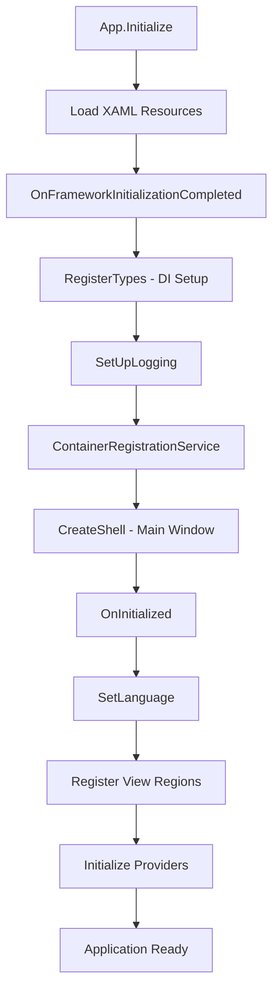
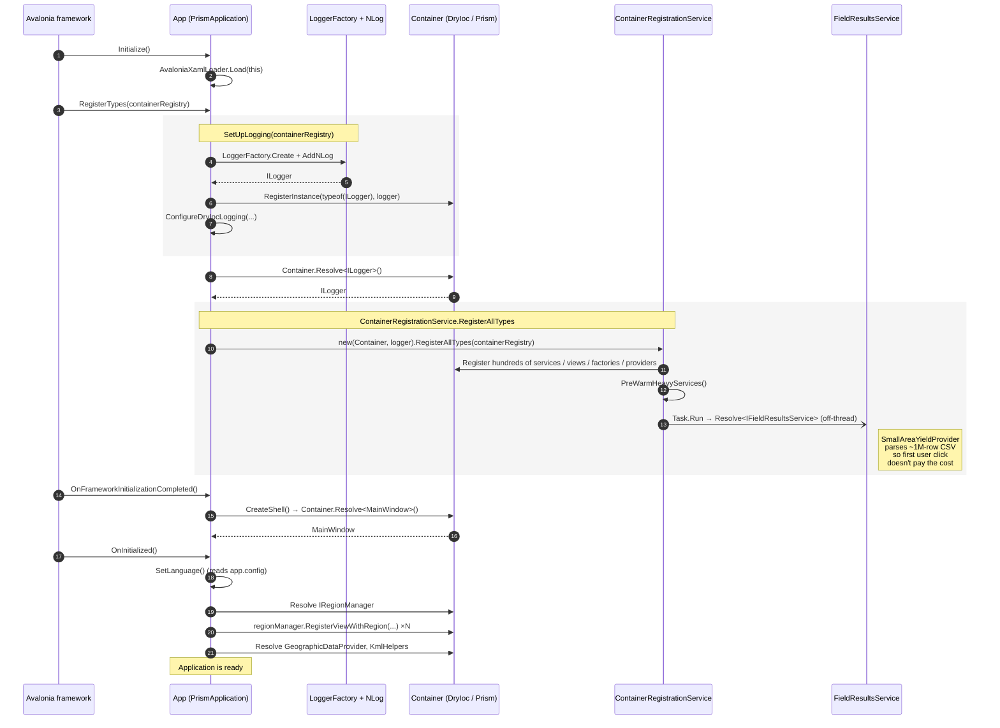

# Holos Application Architecture Guide

## Overview

Holos is a sophisticated desktop application built using modern .NET technologies and architectural patterns. This application is designed for agricultural carbon footprint calculation and farm management, utilizing a robust, modular architecture that promotes maintainability, testability, and scalability.

## Core Technologies & Patterns

### **Application Framework**
- **Avalonia UI**: Cross-platform .NET UI framework for desktop applications
- **.NET 9**: Latest .NET framework providing modern language features and performance improvements
- **C# 13.0**: Latest C# language version with enhanced features

### **Architectural Patterns**
- **MVVM (Model-View-ViewModel)**: Separates UI logic from business logic, enabling better testability and maintainability
- **Dependency Injection (DI)**: Promotes loose coupling and enables easy testing and component swapping
- **Prism Framework**: Provides modular application development with navigation, commands, and event aggregation

### **Dependency Injection Container**
- **DryIoc**: High-performance IoC container used as the underlying DI container
- **Prism.DryIoc**: Integration layer that combines Prism's application framework with DryIoc's container capabilities

## Application Bootstrap Process

Understanding the application's startup and initialization process is crucial for any developer working on this codebase. The entire application lifecycle begins with a single, critical class that acts as the **application bootloader**.

## Starting Point: App.axaml.cs - The Application Bootloader

**Location**: `H.GUI.Avalonia\H.Avalonia\App.axaml.cs`

The `App` class is the **entry point and orchestrator** of the entire application. It inherits from `PrismApplication` and is responsible for:

### **Why This Class Is Critical**

1. **Application Lifecycle Management**: Controls the entire application startup, initialization, and shutdown process
2. **Dependency Injection Setup**: Configures and registers all services, views, and components in the DI container
3. **Framework Integration**: Bridges Avalonia UI, Prism, and DryIoc frameworks
4. **Cross-Cutting Concerns**: Sets up logging, caching, language localization, and error handling

### **Key Responsibilities**

#### **Initialization Phase**
- Loads XAML resources and initializes the Avalonia framework
- Sets up the application lifetime management

#### **Dependency Registration**
- Configures unified logging through NLog. Every class in the codebase logs through the same pipeline — `ILogger` injected via DI for classes the container constructs, or a static `NLog.Logger` field via `LogManager.GetCurrentClassLogger()` for classes it doesn't (providers, helpers, partial classes). See `NLog.config` at `H.GUI.Avalonia/H.Avalonia/NLog.config`.
- Registers hundreds of services, views, factories, and providers
- Wires up the project's custom `PropertyMapper` and the per-type `IModelMapper<,>` implementations under `H.Core/Mappers/`. The codebase deliberately does **not** use AutoMapper — the mapping layer is a small reflection-driven copy-by-name engine that produces compiled delegates for hot paths.
- Configures caching and transfer services

#### **Application Shell Creation**
- Creates the main application window through dependency injection
- Ensures proper ViewModel location and binding

#### **Post-Initialization Configuration**
- Sets up language and culture settings
- Registers views with their designated UI regions
- Initializes geographic and data providers

#### **Application Lifecycle Events**
- Handles application shutdown with proper data persistence

### **Understanding the Flow**

### **DI Bootstrap Sequence (Detailed)**

The high-level flow above is the conceptual order. This sequence diagram shows the actual
inter-class calls during startup — what registers what, and where each major actor enters
the picture. Use it when you need to add a new service / view / provider and want to know
which seam it slots into.

**Why this matters for new contributors:**

- New service → register inside `ContainerRegistrationService.RegisterAllTypes`, after the
  `SetUpLogging` step but before the `MainWindow` is resolved. Prism will then inject it
  into any view-model that declares it as a ctor parameter.
- New view → registered the same way, with `containerRegistry.RegisterForNavigation<TView, TViewModel>()`.
  The view region wiring happens later in `OnInitialized`.
- Heavy startup work → if a service has a multi-second cold-start cost (large CSV parse,
  HTTP probe, etc.), use the `PreWarmHeavyServices` Task.Run pattern so the first user
  interaction doesn't block. `SmallAreaYieldProvider`'s 1M-row parse is the existing
  example.

### **Modern Architecture Benefits**

The architecture implemented in this bootloader provides:

- **Modularity**: Clean separation of concerns with dedicated registration services
- **Testability**: Comprehensive dependency injection enables easy unit testing
- **Observability**: Extensive logging throughout the initialization process
- **Maintainability**: Well-organized, documented code with clear responsibilities
- **Performance**: Optimized container configuration with efficient service resolution

### **Next Steps for Developers**

To fully understand this application:

1. **Start Here**: Study the `App.axaml.cs` class thoroughly - it's your roadmap to the entire application
2. **Follow the DI Trail**: Examine the `ContainerRegistrationService` to understand service registrations
3. **Understand the MVVM Structure**: Look at how views and view models are registered and resolved
4. **Explore Navigation**: Study how Prism regions and navigation work within the application

This bootloader class is not just initialization code - it's the **architectural blueprint** that defines how the entire application is structured, configured, and operated. Master this class, and you'll have a solid foundation for understanding the rest of the Holos application architecture.

---

## Related Documentation

This guide focuses on the application bootstrap and the overall architectural shape. Deeper
material lives in adjacent files:

- **[`H.Content/Documentation/Developer Guide/Carbon_Model_Flow.md`](H.Content/Documentation/Developer%20Guide/Carbon_Model_Flow.md)** — end-to-end Mermaid diagram of the carbon analysis pipeline (View → Analysis → Results), with a class-by-class file index. Essential reading before touching the carbon or nitrogen calculators; the ordering invariants (carbon before nitrogen, animal results primed between stage-state build and final pass) are not obvious from the call sites alone.
- **[`H.Content/Documentation/Developer Guide/Developer_Guide_EN.md`](H.Content/Documentation/Developer%20Guide/Developer_Guide_EN.md)** — IDE setup for Visual Studio / VS Code / Rider, dotnet CLI commands, solution layout, logging + localization workflow.
- **[`CODING_STYLE_GUIDE.md`](CODING_STYLE_GUIDE.md)** — naming conventions, region organization, the Avalonia `StringFormat` pitfall, and the unified logging pattern.
- **[`DEVELOPER_ONBOARDING_GUIDE.md`](DEVELOPER_ONBOARDING_GUIDE.md)** — full first-time setup including SDK install, repository clone, and the typical troubleshooting list.

In-code documentation: the ~60 files most central to the carbon pipeline carry detailed
class-level XML docstrings naming their role, collaborators, and ordering invariants. Pull
up any of `FarmAnalysisService`, `FieldResultsService`, `ICBMSoilCarbonCalculator`,
`IPCCTier2SoilCarbonCalculator`, `N2OEmissionFactorCalculator`, `AnimalResultsService`,
`ManureService`, or the Table_* providers and the class header should orient you within a
few seconds.

Each layer builds upon the foundation established by understanding the application
bootloader process documented above.