# Carbon Model Flow — View → Analysis → Results

End-to-end flowchart for the GHG / carbon analysis pipeline in Holos v5, starting from a user
authoring a simple wheat field in the GUI and ending at the populated `GHGResultsView`.

Useful when:

- onboarding a new contributor onto the carbon code path
- debugging an empty chart / NaN soil-carbon result (look at the failure modes called out below
  the diagram)
- deciding where to add a new calculation step — the diagram shows what runs before/after
  `AssignCarbonInputs` vs `CalculateFinalResultsForField`

The diagram below renders as a Mermaid flowchart on GitHub and in any Markdown viewer that
supports Mermaid.

## Flow

```mermaid
flowchart TD
    %% ========================================================================
    %% 1. GUI AUTHORING
    %% ========================================================================
    subgraph authoring ["1. View / ViewModel — User authors a wheat field"]
        U["User opens MyComponentsView<br>and adds a Field component"]
        S1["FieldComponentView · Step 1<br>name, area, soil polygon<br>(province lives on DefaultSoilData)"]
        S2["FieldComponentView · Step 2<br>AddCropDtoToSystem<br>CropDto: Year=2024, CropType=Wheat<br>IsSecondaryCrop = false<br>→ CropViewItems.Add(viewItem)"]
        S3["Step 3 (optional)<br>manure / fertilizer / harvest yield"]
        Btn["User clicks Results button"]
        U --> S1 --> S2 --> S3 --> Btn
    end

    %% ========================================================================
    %% 2. NAVIGATION
    %% ========================================================================
    Btn --> VM["GHGResultsViewModel<br>.RunAnalysisAsync"]
    VM --> Bg["await Task.Run<br>(off UI thread — Recalculate banner shows)"]
    Bg --> Svc["FarmAnalysisService.RunAnalysis(farm)"]
    Svc --> Init

    %% ========================================================================
    %% 3. BUILD PER-YEAR DETAIL VIEW ITEMS
    %% ========================================================================
    subgraph build ["3. Build the per-year CropViewItem tree (stage state)"]
        Init["InitializeStageState(farm)<br>(skipped if already initialised)"]
        Init --> CreateDV["For each FieldSystemComponent:<br>CreateDetailViewItems"]
        CreateDV --> CreateItems["CreateItems<br>= PreProcessViewItems<br>  (CropViewItems ∪ CoverCrops)<br>+ CreateOrderedViewItems<br>  mod-cycles them across<br>  startYear..endYear"]
        CreateItems --> Per["ProcessPerennials<br>AssignPerennialStandIds<br>(defensive FirstOrDefault for<br>legacy v4-import data shapes)"]
        Per --> Cover["ProcessCoverCrops /<br>ProcessUndersownCrops"]
        Cover --> Graz["CalculateCarbonLostByGrazingAnimals"]
        Graz --> Assign["AssignCarbonInputs<br>(per-crop dispatch loop,<br>one pass per year of each field)"]
    end

    %% ========================================================================
    %% 4. INPUT DISPATCH — ICBM vs IPCC Tier 2
    %% ========================================================================
    Assign --> Strat{"farm.Defaults<br>.CarbonModellingStrategy"}
    Strat -- "ICBM (default)" --> ICBMin["ICBMSoilCarbonCalculator.SetCarbonInputs<br>computes:<br>· PlantCarbonInAgriculturalProduct (Cp)<br>· CarbonInputFromProduct / Straw / Roots / Extraroot<br>· AboveGroundCarbonInput<br>· BelowGroundCarbonInput<br>· ManureCarbonInputsPerHectare<br>· DigestateCarbonInputsPerHectare<br>· TotalCarbonInputs"]
    Strat -- "IPCC Tier 2" --> T2in["IPCCTier2SoilCarbonCalculator.CalculateInputs<br>monthly residue split into<br>metabolic / structural DOM pools"]
    ICBMin --> Climate
    T2in --> Climate
    Climate["CalculateClimateParameter (memoized)<br>+ CalculateTillageFactor<br>+ CalculateManagementFactor"]
    Climate --> Animals["FarmAnalysisService primes<br>FieldResultsService.AnimalResults<br>= AnimalService.GetAnimalResults(farm)<br>(needed before nitrogen calc reads<br>grazing / manure deposits)"]

    %% ========================================================================
    %% 5. FINAL CARBON + NITROGEN PASS
    %% ========================================================================
    Animals --> Final["FieldResultsService.CalculateFinalResults(farm)"]
    Final --> GroupCombine["Per field:<br>· CombineInputsForAllCropsInSameYear<br>  main + cover → Combined* fields<br>· MergeDetailViewItems<br>  one CropViewItem per year"]
    GroupCombine --> Strat2{"Strategy?"}

    Strat2 -- ICBM --> Equil["CalculateEquilibriumYear<br>avg(Combined*) over rotation →<br>steady-state seed values for<br>Y_ag, Y_bg, Y_manure, O pools<br>(CalculateYoungPoolSteadyState*<br>+ CalculateOldPoolSteadyState)"]
    Equil --> Loop["For each year i:<br>CalculateCarbonAtInterval<br>· Y_ag, Y_bg, Y_manure update<br>· OldPool update<br>· SoilCarbon = Y_ag + Y_bg + Y_manure + O<br>· ChangeInCarbon = SoilC_i − SoilC_{i-1}"]
    Loop --> Nloop["CalculateNitrogenAtInterval<br>residue N pool, manure/digestate N,<br>direct + indirect N₂O per ha"]

    Strat2 -- "IPCC Tier 2" --> T2Final["IPCCTier2SoilCarbonCalculator.CalculateResults<br>monthly water + temperature factors,<br>active / slow / passive pool dynamics,<br>SoilCarbon = totalStock"]

    Nloop --> Shelter
    T2Final --> Shelter
    Shelter["CalculateShelterbeltResults<br>(only if farm has ShelterbeltComponents —<br>allometric model, orthogonal to ICBM/Tier 2)"]

    %% ========================================================================
    %% 6. DTO MAPPING
    %% ========================================================================
    Shelter --> Map["For each CropViewItem → ToYearResult →<br>FieldAnalysisYearResult<br>· Year, FieldName, CropType, Area<br>· AboveGroundCarbonInput<br>· BelowGroundCarbonInput<br>· ManureCarbonInput<br>· TotalCarbonInputs<br>· SoilCarbon (kg C / ha)<br>· ChangeInSoilCarbon<br>· DirectN2OPerHectare<br>· IndirectN2OPerHectare"]
    Map --> Dto["FarmAnalysisResults<br>· FarmName, Province, Strategy<br>· YearResults\[\]<br>· ShelterbeltYearResults\[\]"]
    Dto --> UIBack["Continuation resumes on UI thread<br>VM populates ObservableCollections<br>+ BuildSoilCarbonTrendChart"]

    %% ========================================================================
    %% 7. RESULTS VIEW
    %% ========================================================================
    subgraph results ["7. GHGResultsView — what the user sees"]
        UIBack --> RV["GHGResultsView<br>· Header: Farm + Strategy + Recalculate/Export"]
        RV --> Chart["LiveCharts CartesianChart<br>one LineSeries per field<br>X = years, Y = SoilCarbon kg/ha"]
        RV --> Grid["Field DataGrid<br>per-year × per-field rows<br>(C inputs, ΔSoilC, N₂O)"]
        RV --> Sgrid["Shelterbelt DataGrid<br>(only if HasShelterbeltResults)"]
        RV --> Toggle["Strategy ComboBox<br>flip ICBM ↔ Tier 2<br>re-runs analysis on change"]
    end

    %% ========================================================================
    %% CROSS-CUTTING: data providers
    %% ========================================================================
    Providers["Canadian-keyed data providers<br>· SlcClimateDataProvider (daily SLC normals)<br>· Table_4_Monthly_Irrigation<br>· Table_63_Indoor_Temperature<br>· EcodistrictDefaults (FTopo, ecozone)<br>· NationalSoilDataBase / SmallAreaYield<br>· Table_7_Relative_Biomass_Information<br><br>All emit via NLog with first-miss-only<br>suppression on non-Canadian keys"]

    ICBMin -.-> Providers
    Climate -.-> Providers
    Equil -.-> Providers
    T2Final -.-> Providers
    Shelter -.-> Providers
```

## Things the diagram doesn't make obvious

- **The strategy dispatch happens twice.** Once during `AssignCarbonInputs` (per-crop input math) and once inside `CalculateFinalResultsForField` (per-year pool dynamics). Both check `farm.Defaults.CarbonModellingStrategy`. The second one is where ICBM's steady-state denominator can blow up on a zero climate parameter — `CalculateYoungPoolSteadyStateAboveGround` does `numerator / (1 - exp(-k * climateParameter))`, which produces `±∞` or `NaN` when `climateParameter` is 0. LiveCharts silently drops those points, so you get an empty chart with a populated DataGrid. Tier 2's monthly water/temperature math doesn't have that single-divide-by-climate vulnerability and degrades to finite (if wrong) values.
- **The animal pipeline is primed *between* `AssignCarbonInputs` and `CalculateFinalResults`** — not before stage-state build. That ordering matters because `CalculateNitrogenAtInterval` reads `_fieldResultsService.AnimalResults` for grazing/manure N deposits; if it ran earlier, manure-N from grazing animals would be zero for fields that share an animal component.
- **`MergeDetailViewItems` produces new instances via `PropertyMapper`.** The merged copies carry the `Combined*` fields forward but they are *not* the same object references as the originals in `DetailsScreenViewCropViewItems`. Anything in the equilibrium / per-year loop that mutates `viewItemsForField[i]` is writing to a merged copy, and the `SoilCarbon` the chart eventually reads comes from the merged copy too.
- **Stage-state initialisation is cached across analysis runs.** Switching the Strategy ComboBox between ICBM and Tier 2 does *not* re-run `InitializeStageState` — only the downstream math (`CalculateFinalResults` onward) re-runs. The strategy only affects pool dynamics, not the C-input inventory. If you change something upstream that affects inputs (a yield, a crop, a manure application), call `InvalidateFieldStageState()` on the ViewModel or flip `stageState.IsInitialized = false` so the next `RunAnalysis` rebuilds.
- **`AssignPerennialStandIds` has a defensive `FirstOrDefault` fallback** for legacy v4 farms where some years have zero items with `IsSecondaryCrop == false`. Same pattern as three sibling methods (`GetMainCropForYear` in `FieldResultsService.DetailViewItems.cs`, `FieldComponentHelper.cs`, `IFieldComponentHelper.cs`). The fallback exists because the v4 → v5 JSON load path doesn't reliably set the flag.

## Where the failure modes surface

| Symptom in the GUI | Look here first |
|---|---|
| Blank chart but DataGrid populated | ICBM `SoilCarbon` came out `NaN` / `±Infinity`. Check `climateParameter` in `CalculateClimateParameter`; trace the `[GHGAnalysis.ICBM]` lines emitted by `CalculateFinalResultsForField`. |
| Both chart and DataGrid blank, no error | `InitializeStageState` produced zero detail view items. Check that the field has at least one `CropViewItem` and that `CreateDetailViewItems` ran (look for `[GHGAnalysis.Comp]` Trace lines). |
| `InvalidOperationException: Sequence contains no matching element` | Was `AssignPerennialStandIds:114` before the defensive fallback landed — this is now handled. If it surfaces again, look for the same `.Single(...)` pattern in a sibling method that wasn't updated. |
| `[GHGAnalysis] init=` time dominates | `SmallAreaYieldProvider` CSV load (~1M rows). Already pre-warmed in `ContainerRegistrationService.PreWarmHeavyServices`; check that path actually fires on startup. |
| Output window flooded with provider warnings | Non-Canadian province leaked past Guard A somehow. Each provider memoises first-miss-only via static `HashSet`, so should be ≤1 line per unique key per process — if you see many, the suppression hashset isn't being hit (different lock object, etc.). |

## File / class index

| Stage in the diagram | Type / file |
|---|---|
| Authoring | `H.Avalonia/ViewModels/ComponentViews/LandManagement/Field/FieldComponentViewModel.cs` |
| Recalculate button + chart wiring | `H.Avalonia/ViewModels/Results/GHGResultsViewModel.cs`, `Views/ResultViews/GHGResultsView.axaml` |
| Analysis entry | `H.Core/Services/Analysis/FarmAnalysisService.cs` |
| Stage-state build | `H.Core/Services/LandManagement/FieldResultsService.DetailViewItems.cs` |
| Per-crop input dispatch | `FieldResultsService.Carbon.cs` (`AssignCarbonInputs`) |
| ICBM inputs | `H.Core/Calculators/Carbon/ICBMSoilCarbonCalculator.cs` (`SetCarbonInputs`) |
| Tier 2 inputs | `H.Core/Calculators/Carbon/IPCCTier2CarbonInputCalculator.cs` |
| Final ICBM math | `FieldResultsService.Carbon.cs` (`CalculateFinalResultsForField`, `CalculateEquilibriumYear`, `CalculateCarbonAtInterval`) |
| Final Tier 2 math | `H.Core/Calculators/Carbon/IPCCTier2SoilCarbonCalculator.cs` (`CalculateResults`) |
| Shelterbelt | `H.Core/Calculators/Shelterbelt/ShelterbeltCalculator.cs` |
| Result DTOs | `H.Core/Models/Results/FarmAnalysisResults.cs`, `FieldAnalysisYearResult.cs`, `ShelterbeltYearResult.cs` |
